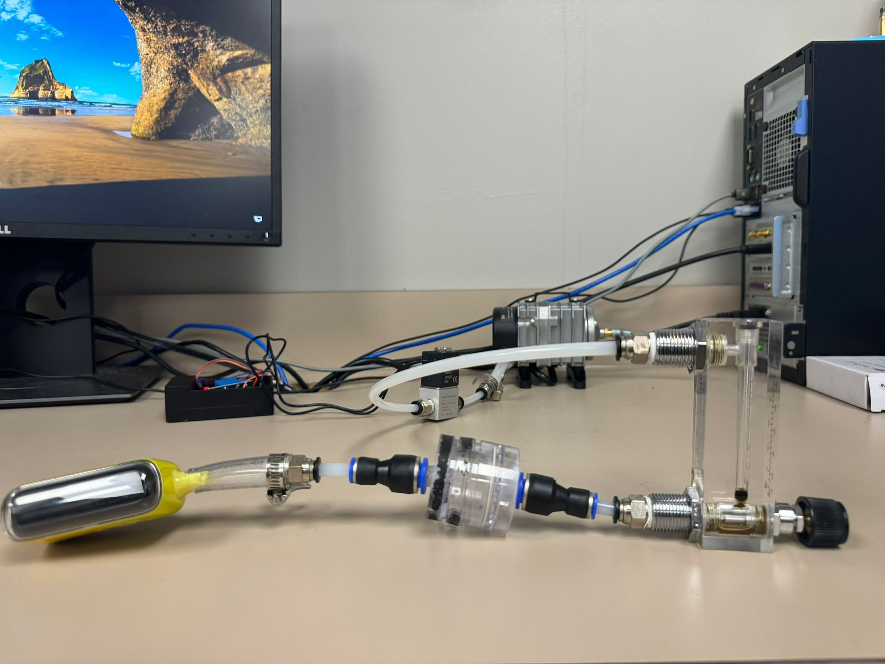

# MIST
The Mechanized Inhaling Smoking Tool (MIST) is an advanced human vape simulation apparatus, conceived and developed at the Hawk Behavioral Health Laboratory within the Department of Clinical Psychology at the University at Buffalo. For more information, please visit the [Hawk Behavioral Health Lab.](https://ubwp.buffalo.edu/hawklab/)

This innovative device was engineered to facilitate biomedical research by enabling investigators to autonomously test vapes and cigarettes for study participants, thereby enhancing research efficiency.

MIST operates in conjunction with the FRIENDS device, an electromagnetic puff detection system currently under development, designed for electronic nicotine delivery systems research. The system is equipped with a Cambridge filter to capture e-liquid from the vapor, preventing clogging in the rotameter and solenoid valves.

Version 3 (v3) represents a significant advancement over the original v2 model, achieving complete automation. This iteration replaces the mechanical pneumatic pedal valve with a solenoid valve, markedly improving the precision and speed of valve operation. The solenoid valve is powered by a grounded AC supply and is controlled via a Raspberry Pi 4 Model B microcomputer. Additionally, the Raspberry Pi operates over Wi-Fi and is secured with a password to maintain system confidentiality and comply with the university's firewall protocols.

## Components

| Component                | Purpose                                                                 |
|--------------------------|-------------------------------------------------------------------------|
| Pneumatic tubing (1/4" diameter)           | Connects the vape adapter to the rotameter, to solenoid valve, and pump.       |
| Aquarium pump (20W)           | Provides suction for vape device       |
| Solenoid Valve           | Controls the opening/closing of the valve with increased accuracy       |
| Raspberry Pi 4 Model B   | Powers the solenoid valve and controls the device functions. Stores the program code.             |
| Cambridge Filter         | Collects e-liquid from the smoke to prevent jamming in the rotameter    |
| Rotameter (0 to 5 LPM)               | Measures the flow rate of the smoke, from the inlet-vape to the solenoid valve                                     |
| Relay Switch             | Controls the electrical connection for the solenoid valve               |
| Male adapters           | Connection from 1/4" OD to 1/4" NPT - to create vape adapters      |
| Vape adapters           | A set of tubing adapters to suit various vape mouth sizes and attach them to the MIST       |

## Demo videos
### Setup

[Layout video](v3/MIST_layout_cinematic.mp4)

### Operation

[Operation video](v3/MIST_operation_demo_video.mp4)
